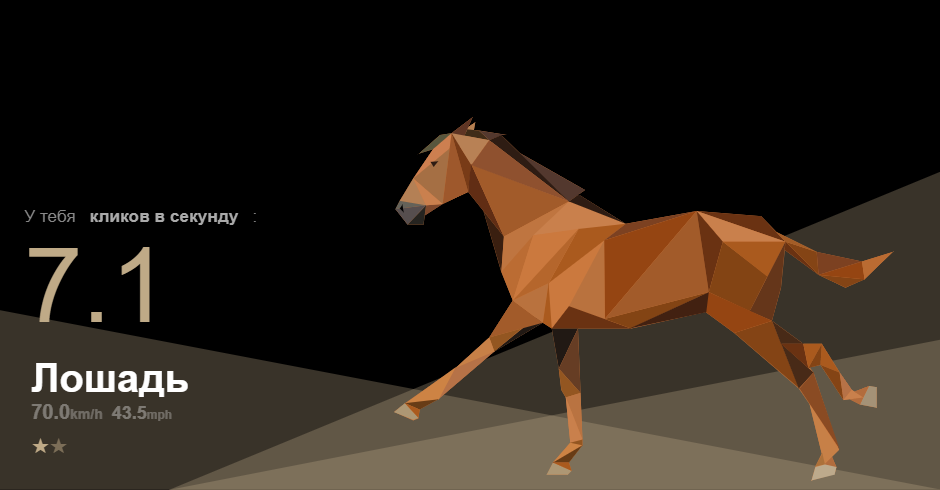

# 7 Кругов раздумий или что выбрать

Долго думал, что лучше выбрать для реализации моей задачи. В целом остановился на Redis и локалном кеше.
Для меня были важны следующие аспекты:

+ Скорость
+ Память
+ Инфраструктуры 

### Скорость
>Локальный кеш обеспечит высокую скорость доступа к данным, поскольку данные будут доступны непосредственно в оперативной памяти, минуя задержки сети и обращения к базе данных.
### Память
>Redis имеет оптимизированную структуру данных, что позволяет эффективно использовать память. Благодаря этому он может эффективно обрабатывать большие объемы данных, при этом обеспечивая быстрый доступ к ним.
### Инфраструктура
>Для использования Redis требуется дополнительные вычислительные ресурсы для обслуживания инфраструктуры Redis, включая сервер(ы) для развертывания и поддержки Redis. В то время как локальный кеш не требует дополнительных вычислительных мощностей и работает непосредственно в рамках приложения, что делает его более экономичным в использовании ресурсов.

# Выбор
Взвесив все **ЗА** и **ПРОТИВ**, мое внимание упало на **КЕШ** так как *~~все будут делать Redis~~* 2 балла у кеша, 1 балл Redis

# Основные требования к реализации 
-  Добавление данных, если юзер еще не кликал
-  Обновление данных, если юзер уже кликал
-  Очистка данных, если достигнут предел клик/сек или истек срок жизни кеша
-  Покрытие тестами 
-  Логги
>Логги нужны для тех, кто захочет извлечь полезную информацию из данных.  **CyberPolice** или **бизнес-аналитики**. 

# Конфигурация
Надо было собрать эмперическую базу. Я подумал:"Сколько кликов я сам смогу сделать за секунду". После этого я смогу понять основные параметры для настройки моей фукции через константы в config файле. 
Использовал обычный кликер несколько раз для подсчета моих кликлв. [Cliker](https://www.arealme.com/click-speed-test/ru/)
   
    В среднем получилось 7 клик/c  

# Заключение
Теперь, имея ясные требования и понимание процесса, можно приступить к разработке с *~~сомнением~~* уверенностью в выбранном подходе 

